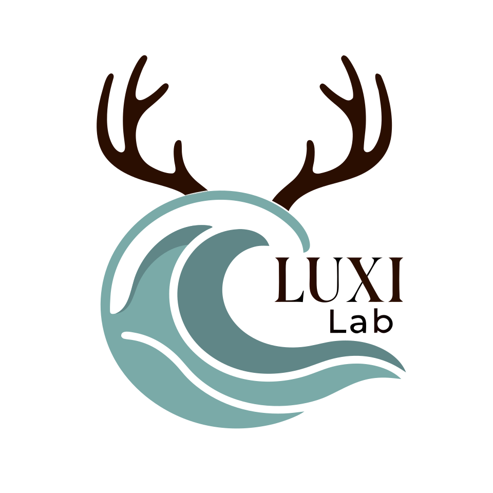

<div align="center">
  
  &nbsp;&nbsp;
  
</div>

<h1 align="center">脉息 · MaiXi（PulseStream）</h1>

<p align="center">
  <strong>光映微澜，脉息自明</strong><br/>
  <em>Reading the subtle pulse, flowing with every breath.</em>
</p>

<p align="center">
  
  
  
  
  
</p>

<p align="center">
  <b>鹿溪联合创新实验室</b>（LUXI Joint Innovation Lab）出品<br/>
  仓库：<a href="https://github.com/itrilogy/LUCY-MAIXI">itrilogy/LUCY-MAIXI</a>
</p>

---

**脉息 · MaiXi**（工程代号 PulseStream / BioPulse）是一个基于视觉的远程生理感知 (rPPG) Web 平台。本项目在上游开源项目的基础之上进行了深度的工程化与场景化拓展，突破了单一模型的局限，引入了多模型、多场景矩阵架构，能够直接从普通网络摄像头视频流中无感提取心率 (Heart Rate) 和呼吸率 (Respiratory Rate)。

## 🧠 系统架构与技术原理

1. **多模型与全场景矩阵**（每个场景只展示该模型真实输出的任务）：
   - **标准健康监测 (SCAMPS，默认)**：与 `mmrphys-live-base` 对齐的 `/255` 预处理、12 s 起算、30 s FFT，BVP + 呼吸。
   - **基础快速检测 (TS-CAN)**：轻量流式网络，仅心率 / BVP。
   - **驾驶/疲劳监测 (BigSmall)**：心率、呼吸与 12 维 AU；疲劳指数为启发式。
   - **科研高精分析 (PhysFormer)**：BVP；HRV 仅在抽出稳定 IBI 后计算。
2. **前端隔离架构**：采用 React SPA 模式，将繁重的深度学习推理和信号处理（Butterworth 滤波、FFT 频域分析）通过 Web Workers 分离至后台线程，确保高平滑的 30FPS UI 渲染。
3. **时间差分驱动模型**：基于 3D 卷积神经网络 (3D CNN) 的 MMRPhysSEF 模型架构。系统输入的是 72x72 分辨率的面部时间差分序列 (Time Difference)，有效地消除了环境光的 DC 缓变，强化了由于血容量搏动引起的面部微观颜色与运动变化。
4. **本地级实时引擎**：基于 ONNX Runtime Web，充分利用浏览器端 WebAssembly 和 SIMD 硬件指令集加速，使得 3D 卷积推理无需 GPU 也可流畅运行于普通终端设备。

## 📚 开源基石文献 (Open Source)

本代码项目构架与模型推理逻辑基于以下卓越的开源项目：
* **MMRPhys-Live**: [https://github.com/PhysiologicAILab/mmrphys-live](https://github.com/PhysiologicAILab/mmrphys-live)
* **MMRPhys Model**: [https://github.com/PhysiologicAILab/MMRPhys](https://github.com/PhysiologicAILab/MMRPhys)
* **rPPG-Toolbox**: [https://github.com/ubicomplab/rPPG-Toolbox](https://github.com/ubicomplab/rPPG-Toolbox)

## 📖 学术引文 (Citations)

**MMPRPhys Related**

If you utilize the MMRPhys model or this web application in your research, please cite the following papers:
1. Jitesh Joshi and Youngjun Cho, "Efficient and Robust Multidimensional Attention in Remote Physiological Sensing through Target Signal Constrained Factorization", 2025. arXiv: 2505.07013 [cs.CV]
2. Jitesh Joshi, Youngjun Cho, and Sos Agaian, "FactorizePhys: Effective Spatial-Temporal Attention in Remote Photo-plethysmography through Factorization of Voxel Embeddings", NeurIPS, 2024.
3. Jitesh Joshi and Youngjun Cho, "iBVP Dataset: RGB-thermal rPPG Dataset with High Resolution Signal Quality Labels", MDPI Electronics, 13(7), 2024.

**rPPG-Toolbox Related**

If you find our paper or this toolbox useful for your research, please cite our work.  
如果您发现我们的论文或此工具箱对您的研究有用，请引用我们的工作。

```bibtex
@article{liu2022rppg,
  title={rPPG-Toolbox: Deep Remote PPG Toolbox},
  author={Liu, Xin and Narayanswamy, Girish and Paruchuri, Akshay and Zhang, Xiaoyu and Tang, Jiankai and Zhang, Yuzhe and Wang, Yuntao and Sengupta, Soumyadip and Patel, Shwetak and McDuff, Daniel},
  journal={arXiv preprint arXiv:2210.00716},
  year={2022}
}
```

## 🎨 品牌标识

| 标识 | 预览 | 说明 | 源文件 |
| :---: | :---: | :--- | :--- |
| **产品方标** |  | 面部同心环 + 脉搏波形 + 呼吸节律（鹿溪绿底） | `public/brand/favicon.svg` |
| **产品字锁** | [`public/brand/logo.svg`](public/brand/logo.svg) | 横版产品字锁 | `public/brand/logo.svg` |
| **实验室主标** |  | 官方 LUXI LAB | `public/brand/luxi-lab-main.svg` |

**色板（LUXI CI）**

| Token | 色值 | 用途 |
| :--- | :--- | :--- |
| 鹿溪绿 | `#0D5E42` | 主色 / 图标底板 |
| 源启白 | `#F5F7FA` | 浅色背景 / 反白 |
| 进化蓝 | `#00D2FF` | 溪流 / 数据高亮 |
| 标题金 | `#F1C40F` | 落点 / 显著信号 |

## 🛠 开发与运行指南 (Development Reference)

### 环境要求 (Prerequisites)
- Node.js (v16 或更高版本)
- npm (v7 或更高版本)
- 授予摄像头访问权限的现代 Web 浏览器

### 本地部署 (Installation & Run)
1. 克隆本仓库并进入根目录：
   ```bash
   git clone https://github.com/itrilogy/LUCY-MAIXI.git
   cd LUCY-MAIXI
   ```
2. 安装环境依赖：
   ```bash
   npm install
   ```
3. 启动开发服务器：
   ```bash
   npm run dev
   ```
4. 生产环境构建：
   ```bash
   npm run build
   ```

---

<div align="center">
  
  <p><strong>脉息 · MaiXi</strong> · 光映微澜，脉息自明</p>
  <p>© 鹿溪联合创新实验室 · LUXI Joint Innovation Lab</p>
  <p><em>林深见鹿，源启清溪 · Deep Insights, Evolutionary Origin.</em></p>
</div>
